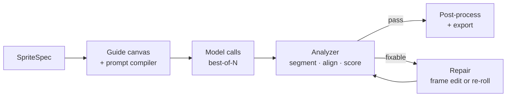
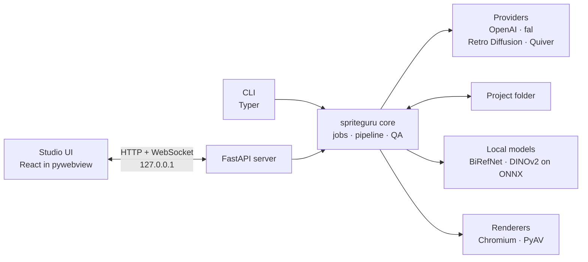
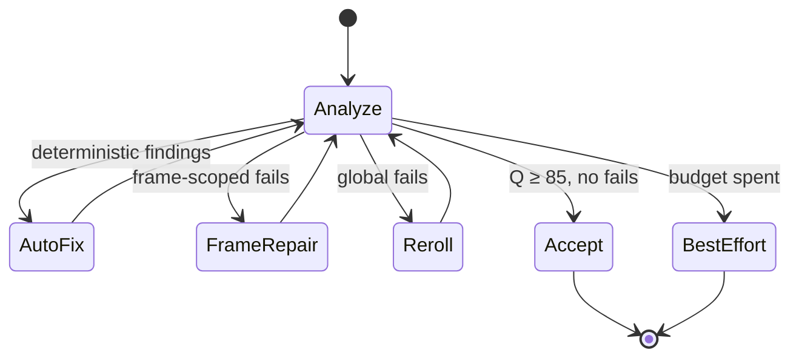

# Local sprite studio: desktop implementation plan

Sep 24, 2026 · @Anıl Beyazoğlu

Build a local studio: a Python engine plus a React UI that calls AI providers directly with your own API keys, with nothing hosted. Rough estimate for one experienced developer: guided sprite sheets from the CLI in about 4 weeks and the full pipeline in about 13.

## 1. Scope and core principle

The studio turns a character description into game-ready animation assets: a clean sprite sheet, per-frame PNGs, an engine atlas and an animated preview. It runs on your machine, and its only network traffic goes to the AI providers in section 4.

The core principle is **control the generation so post-processing becomes deterministic**. Every model call is shaped by a machine-readable `SpriteSpec` (grid, cell size, ground line, chroma key, pose per frame), so the analyzer knows what the image should contain and can measure the gap. Everything after generation is a pure function of pixels plus spec: reproducible, testable and free to re-run.



Sections 2 to 5 cover the engine, providers and project folder; 6 to 8 generation; 9 to 14 the analyzer; 15 export; 16 evaluation; 17 and 18 the interface and roadmap. Scope: one user; 2 to 16 frames per animation per direction; side-view and four-direction top-down animations; four styles: pixel art (24 to 128 px characters), HD cartoon and painted (256 to 1024 px frames), and vector.

## 2. Architecture and stack

The engine is Python (`spriteguru`) with two front doors, a CLI and a local FastAPI server, and the UI is a Vite React studio shown in a pywebview window. The CLI calls the core directly and the API only wraps the same functions, so no logic lives in the transport layer.



| Layer | Decision |
| --- | --- |
| Engine | Python 3.12, managed with uv |
| Local API | FastAPI on Uvicorn, bound to 127.0.0.1 |
| CLI | Typer |
| Studio UI | React with Vite |
| Desktop window | pywebview (section 18) |
| Build | PyInstaller |
| CV and numerics | NumPy, OpenCV, SciPy, scikit-image, numba |
| Local ML | ONNX Runtime on the CPU execution provider: BiRefNet matting, DINOv2-small embeddings |
| SVG rendering | Playwright with headless Chromium |
| Video decoding | PyAV |

`spriteguru studio` starts the engine and opens the studio; from D8 on it opens in the pywebview window, before that in the default browser.

The server binds to 127.0.0.1 only, requires a random per-launch token on every request, and allows only the studio's origin in CORS, because any web page in your browser could otherwise send requests to localhost and spend your API credits. ONNX Runtime uses the CPU execution provider on every machine so results are identical across machines; matting runs per cell and only as a fallback, so CPU is fast enough.

## 3. Engine layout and library map

One package, one module per pipeline stage, one notebook per module for visual debugging. Each stage is prototyped in its notebook against golden fixtures, then frozen into its module with a golden test.

```text
spriteguru/
  spec.py           SpriteSpec (pydantic); shared with the UI through OpenAPI
  registry.yaml     model ids, fixed parameters, prices, route table (6.5, 8)
  planner.py        grid planner (6.2)
  guide.py          guide canvas renderer (6.3)
  choreo/           actions as YAML: frame lines, joint angles, timing (7.5)
  prompts/          Jinja2 templates, versioned (7.2–7.7)
  providers/        openai.py, fal.py, retrodiffusion.py, quiver.py (4)
  pipeline/         matte.py (9), layout.py (10), register.py (11), pixel.py (12),
                    temporal.py (13), video.py (13.7), vector.py (6.8), motion.py (6.9)
  qa/               metrics.py, judge.py, score.py, repair.py (14)
  export/           engine formats and previews (15)
  jobs.py           job runner with checkpoints (5)
  api.py, cli.py
  eval/             golden sets, runner, HTML report (16)
notebooks/          one per pipeline module
tests/golden/       fixture sheets + expected boxes, anchors, findings
```

Every algorithm step maps to one library call plus glue:

| Step (section) | Python implementation |
| --- | --- |
| OKLab conversion (9.2) | A 10-line NumPy function with Ottosson's matrices |
| Key colour mode (9.2) | `numpy.histogramdd` over OKLab samples |
| Tile plate with filled holes (9.2) | Per-tile medians, `cv2.inpaint` on the tile grid, `cv2.resize` bilinear |
| Hysteresis matte (9.3) | `skimage.filters.apply_hysteresis_threshold` |
| Enclosed pockets (9.3) | `scipy.ndimage.binary_fill_holes`, then `ndimage.label`, `ndimage.sum` and `ndimage.mean` per pocket |
| ML matte fallback (9.5) | `rembg` with the `birefnet-general` session |
| Line removal (10.1) | `cv2.morphologyEx` open with a long `MORPH_RECT` kernel |
| Components (10.1, 10.4) | `cv2.connectedComponentsWithStats(connectivity=8)` |
| Distance transform (10.3, 11.1) | `cv2.distanceTransform(mask, cv2.DIST_L2, 5)` |
| Cut, seam and lattice DPs (10.2, 10.3, 12.2) | NumPy with `numba.njit` inner loops |
| Registration (11.2) | `cv2.matchTemplate` with `TM_CCOEFF_NORMED` |
| Joint offsets, Fourier fit (11.2, 11.3) | `numpy.linalg.lstsq` |
| Savitzky–Golay (11.3) | `scipy.signal.savgol_filter` |
| Lanczos in premultiplied linear light (11.4) | Premultiply and linearize in NumPy, then `cv2.resize` with `INTER_LANCZOS4` |
| Identity and flip embeddings (11.5) | DINOv2-small on `onnxruntime` |
| Palette with pinned centres (12.4) | A 20-line Lloyd loop in NumPy (scikit-learn cannot pin centres) |
| Pixel benchmark baselines (12.6) | `unfake` from PyPI, proper-pixel-art from GitHub, Retro Diffusion's free Pixel Fixer API |
| Held–Karp order (13.2) | `python_tsp.exact.solve_tsp_dynamic_programming` |
| Gait spectrum (13.5) | `numpy.fft.rfft` |
| Video frames, sharpness (13.7) | PyAV; `cv2.Laplacian(g, cv2.CV_64F).var()` |
| GIF preview (15) | Pillow `save(..., save_all=True)` |
| Guide canvas (6.3) | Pillow `ImageDraw` at 4× then downsampled |
| SVG sanitization (6.8) | `defusedxml` to parse, then an `lxml` element and attribute allowlist |
| SVG rendering and sampling (6.8) | Playwright headless Chromium: pause `document.getAnimations()`, seek `currentTime`, `screenshot(omit_background=True)` |
| Rig pivots and poses (6.9) | Per-part renders for overlap centroids; NumPy 3×3 world matrices written as SVG `matrix()` |
| Path parsing and morphing (6.9) | `svgelements` to parse paths; NumPy to interpolate coordinate arrays and take anchor tangents |
| Motion-spec validation (6.9) | A pydantic schema plus command-structure checks on morph keys |

Vectorized NumPy handles 4K sheets comfortably. Per-frame stages run in a `ProcessPoolExecutor`, since frames are independent until registration.

## 4. Provider layer

The engine calls each provider's official SDK or HTTP API directly with your keys. Logging, caching and spend control come from three local pieces: a content-addressed cache, a cost ledger and a budget cap.

### 4.1 Keys

Keys live in the OS keychain through `keyring` (macOS Keychain, Windows Credential Manager, Secret Service on Linux). Environment variables (`OPENAI_API_KEY`, `FAL_KEY`, `RD_API_KEY`, `QUIVERAI_API_KEY`) override the keychain during development. The settings screen writes keys; the engine never returns them to the UI and never logs them.

### 4.2 One interface

```python
class ImageProvider(Protocol):
    id: str  # registry key, e.g. "gpt-image-2.5-flare"
    async def generate(self, req: GenRequest) -> list[Candidate]: ...
    async def edit(self, req: EditRequest) -> list[Candidate]: ...  # images[0] is the guide canvas
```

| Provider | Call | Local notes |
| --- | --- | --- |
| OpenAI | `images.generate` for turnarounds; `images.edit` for guided sheets, repairs and in-betweens, with the guide first, the reference second and a mask exposing the cells to paint; `responses.create` for GPT-6 Sol motion authoring and the GPT-6 Luna judge, with image inputs, `reasoning.effort` from Settings and a JSON-schema `text.format` | Synchronous; 180 s timeout for image calls |
| fal | `fal_client.upload_file` for inputs, then `subscribe_async`, which polls the queue | No webhook server |
| Retro Diffusion | `POST /v2/inferences` with an `X-RD-Token` header, then poll `/v2/inferences/tasks/{task_id}` | Native-resolution start frames; `check_cost` before every call; one automatic retry on failure, since failures are refunded |
| Quiver | `POST /v1/svgs/generations` and `/v1/svgs/animations` with a Bearer key and `stream: false` | Synchronous JSON |

Every call runs under a per-provider `asyncio.Semaphore` of 4, with exponential backoff and jitter on 429 and 5xx and a 10-minute total timeout. Each request id is written to the ledger before sending, so a crash mid-call shows up as an unknown outcome instead of silent spend.

### 4.3 Cache and replay

The cache key is a SHA-256 of provider, model, canonical JSON parameters, rendered prompt, the hash of every input image and the seed. A hit returns stored outputs without a call. `--replay` runs whole jobs from cached candidates only, so iterating on sections 9 to 15 costs nothing, and that is where most development time goes.

### 4.4 Ledger and budget

Every call appends one line to `ledger.jsonl`: time, job, provider, model, parameter digest, n, estimated cost from the registry's price table, latency and status. The job runner enforces a session cap and a per-job cap and asks before any call that would cross one; video jobs always ask. Estimates are reconciled against provider dashboards monthly, since not every API returns usage.

Each candidate also gets a provenance sidecar: template id and version, rendered prompt, model, parameters, provider request id and cost, which makes any good result reproducible and any bad one debuggable.

## 5. Jobs and project folder

A job is a state machine (compile, generate, analyze, decide, repair or re-roll, export), run as one asyncio task that checkpoints `job.json` before and after every step. On restart the engine resumes unfinished jobs from their last completed step, and because provider steps go through the cache, resuming never pays twice for a finished call.

A global semaphore allows three concurrent jobs on top of the per-provider limits. Cancellation is cooperative between steps; an in-flight provider call is allowed to finish so its output lands in the cache. Step events (candidate ready, score, finding, spend) go to an in-process pub/sub and out over the WebSocket.

The project folder holds characters, specs, job history, cache and outputs in one place you can inspect with a file browser:

```text
MyGame.sprites/
  project.json                  style, palette size, target engine, fps, game asset folder
  characters/knight/
    character.json              canonical reference: palette, height, head ratio, mirrorable
    ref/turnaround.png  ref/side-e.png  ref/side-w.png  ref/front.png  ref/back.png
    ref/character.svg           vector characters only
  animations/knight-walk-E/
    spec.json
    jobs/20260924-101203/
      job.json                  state-machine checkpoint
      guide.png  prompt.txt
      candidates/c1.png  c1.meta.json  c1.report.json
      repairs/f5-r1.png
    final/
      sheet.png  atlas files  frames/000.png  preview.gif  report.json
  cache/                        content-addressed provider outputs
  ledger.jsonl
  eval.sqlite                   golden-set results (16)
```

The project folder lives inside the game repository, with Git LFS for images. `spec.json`, `character.json` and `final/` are committed; jobs and cache are ignored. Every export also copies `final/` into the game asset folder named in `project.json`, so the engine re-imports on change.

## 6. Generation strategy

The biggest quality lever is the input canvas, not the prompt. Guided sheets use **guided canvas completion**: the engine renders a guide image (a reference strip plus pose mannequins on a known grid over a chroma key), and GPT Image 2.5 replaces the mannequins with the character. The model cannot misplace frames it is painting over, and the analyzer knows where every frame should be.

### 6.1 SpriteSpec

Every job starts from one typed spec. The CLI and the studio build it, and every later stage reads it.

```python
class Character(BaseModel):
    description: str                  # 1–3 sentences, visual facts only
    refs: list[Path] = []             # approved turnaround views
    palette: list[str] = []           # hex, extracted from the side view
    heads_tall: float | None = None   # measured from the side view
    mirrorable: bool = True           # symmetric design: left = flip(right)

class Style(BaseModel):
    kind: Literal["pixel", "hd-cartoon", "painted", "vector"]
    pixel_height: int | None = None   # logical px of the character, pixel style only
    palette_size: int = 16
    outline: Literal["dark", "selective", "none"] = "dark"

class SpriteSpec(BaseModel):
    character: Character
    view: Literal["side", "top-down"]
    facing: Literal["E", "W", "N", "S"] = "E"   # side view uses E and W
    action: str                       # walk, run, idle, jump, attack-melee, cast, hurt, death …
    frames: int = Field(ge=2, le=16)
    loop: bool
    motion: Literal["in-place", "root-motion"] = "in-place"
    style: Style
    key: str | None = None            # chroma key, auto-picked when empty (6.6)
    fps: int = 12
    engine: Literal["phaser", "pixi", "godot", "unity", "gamemaker"] = "godot"
```

### 6.2 Grid planner

The planner lays out N frame cells plus a reference strip one cell wide on the left, over GPT Image 2.5's size rules: both sides divisible by 16, aspect between 1:3 and 3:1, and no more pixels than 2560×1440. It enumerates `cols × rows ≥ N` and minimizes this cost:

```latex
C = \left|\ln\frac{a_{cell}}{a_{target}}\right| + \lambda_1\, n_{empty} + \lambda_2\, (rows-1) + \lambda_3\, \max\!\left(0, 1-\frac{h_{cell}}{h_{min}}\right)
```

Here `a_cell` is cell width over height and `a_target` depends on the action's widest pose: about 0.8 for idle, 0.9 for walk, 1.1 for run and 1.3 for melee attacks. `h_min` is the minimum cell height: 320 px for HD styles, and 4 source px per logical pixel for pixel art (a 96 px character needs about 400 px). Rows are penalized because baseline and order discipline degrade as rows grow.

| Frames | Grid + strip | Canvas | Cell |
| --- | --- | --- | --- |
| 4 | 2×2 + strip | 1536×1024 | 512 px |
| 6 | 3×2 + strip | 2048×1024 | 512 px |
| 8 | 4×2 + strip | 2560×1024 | 512 px |
| 12 | 4×3 + strip | 2240×1344 | 448 px |
| 16 | 4×4 + strip | 1920×1536 | 384 px |

### 6.3 Guide canvas

`guide.py` draws the guide with Pillow at 4× resolution and downsamples it, which gives clean anti-aliased mannequins. The guide is the first image of the edit call, with exactly the output dimensions; the reference is also sent as the second image, and the mask exposes only the frame cells, so the strip stays untouched.

| Layer | Content | Why |
| --- | --- | --- |
| Background | Flat chroma key (6.6), whole canvas | Edit models preserve untouched pixels, so the key survives |
| Reference strip | The approved side view in the strip's top cell, at target scale, feet on the ground line; cropped after generation | In-context identity anchor that fixes scale for every frame |
| Mannequins | Grey capsule-limb figure per cell, posed from the choreography, scaled to the character's proportions | Locks pose, scale, position and frame count |
| Depth cue | Far-side limbs darker grey, near-side limbs lighter | Stops the classic error of the same limb leading twice |

The guide carries no text, numbers or lines, because models copy them. Mannequins are filled silhouettes, which instruction-edit models read as figures to replace. The reference strip is the in-context equivalent of diptych prompting: a model completing a canvas that already shows the finished character copies its design far more faithfully than one reading a separate reference.

### 6.4 Character lock

Identity is generated once and reused for every animation. GPT Image 2.5 sunburst renders a turnaround (front, side facing right, side facing left, back) on a magenta key from the turnaround template (7.3), and you approve it. The analyzer crops the four views, uses the right-facing side view as the canonical reference, and stores its palette, height in pixels and head-to-body ratio. Pixel characters pass their views through pixel reconstruction (12) to get true-resolution start frames, and vector characters get their SVG from Quiver (6.8).

Side-view animations are generated facing east. West-facing animations are a horizontal flip when `mirrorable` is true and their own job from the west-facing side view when it is false. Top-down sets have four directions, each its own job seeded by the matching view: back for N, side views for E and W, front for S.

### 6.5 Mode routing

The route follows from the style and the spec's `loop` flag; nothing is chosen per job.

| Style | Looping animations | One-shot animations |
| --- | --- | --- |
| Pixel | Retro Diffusion advanced animation | Guided canvas edit on GPT Image 2.5 flare, then pixel reconstruction (12) |
| HD cartoon, painted | Video-to-sprite on MiniMax H3 Max (13.7) | Guided canvas edit on GPT Image 2.5 flare |
| Vector | Idle: Quiver micro-animation (6.8); every other loop: AI-coded animation (6.9) | AI-coded animation (6.9) |

**Retro Diffusion loops.** The pixel start frame from 6.4, padded onto a transparent canvas 1.33× larger, goes to `rd_advanced_animation__walking` for walks, `__idle` for idles and `__custom_action` with the action as its prompt for every other loop. `frames_duration` is the spec's frame count, so pixel loops use 4, 6, 8, 10, 12 or 16 frames; `input_palette` carries the character palette and `return_spritesheet` is true.

**H3 Max loops.** The character on a chroma canvas, at 60% of the canvas height and centred so limbs never leave the frame, goes to [MiniMax H3 Max image-to-video on fal](https://fal.ai/models/minimax/h3-max/image-to-video/llms.txt) as both `image_url` and `end_image_url`, so the clip closes into a loop. `prompt_expansion_mode` is `disabled`, `duration` is 5 and `resolution` is `768P`, with the video prompt from 7.6.

### 6.6 Chroma key selection

The turnaround always uses magenta `#FF00FF`; every later job picks its key from the palette the turnaround yields. Candidates are magenta, green `#00FF00`, cyan `#00FFFF` and blue `#0000FF`; the winner has the largest minimum OKLab distance to any palette cluster covering over 1% of character pixels, and must reach at least 0.15. The prompt names the key as a word and a hex code, and the guide background is painted in it. GPT Image 2.5 always runs with `background: "opaque"`, so every raster route shares one chroma pipeline.

### 6.7 Best-of-2

Guided jobs request two candidates in one call (`n: 2`); the analyzer scores both, and the studio shows the winner with the other as an alternate. With a single-candidate pass rate p:

```latex
P(\text{at least one pass}) = 1 - (1-p)^2
```

At p = 0.5 that gives 75%. Video, Retro Diffusion and vector jobs generate one candidate and rely on the re-roll rules in 14.4.

### 6.8 Vector mode (Quiver Arrow 2)

Vector characters come from Quiver's `arrow-2` model, which also animates their idle loops. The character SVG is generated with `/v1/svgs/generations` from the approved side view, with `reasoning_effort: "high"`, the vector style block as `instructions`, a `viewBox` equal to the frame size, and the rig parts from 6.9 named in the prompt (7.6). Frames render in headless Chromium, so identity, scale, pivot and loop are exact by construction.

**Idle micro-animation.** The character SVG goes to `/v1/svgs/animations` with the prompt "breathe gently and bob in place, feet fixed". The response carries the animated SVG plus `loop_period_ms` and `opening_animation_ms`; the sampler skips the opening and takes one loop period at N even steps:

```latex
t_k = t_{open} + \frac{k\,T}{N}, \qquad k = 0, \dots, N-1
```

Playwright drives headless Chromium with networking disabled; the sanitizer has already set the root `width` and `height` to the frame size.

```python
async def sample_svg(svg: str, n: int, period_ms: float, opening_ms: float | None,
                     w: int, h: int) -> list[bytes]:
    async with async_playwright() as pw:
        browser = await pw.chromium.launch()
        ctx = await browser.new_context(viewport={"width": w, "height": h}, offline=True)
        page = await ctx.new_page()
        await page.set_content(f"<body style='margin:0;background:transparent'>{svg}</body>")
        frames = []
        for k in range(n):
            t = (opening_ms or 0) + k * period_ms / n
            await page.evaluate("""t => {
              document.getAnimations().forEach(a => { a.pause(); a.currentTime = t; });
              document.querySelectorAll('svg').forEach(s => { s.pauseAnimations?.(); s.setCurrentTime?.(t / 1000); });
            }""", t)
            frames.append(await page.screenshot(omit_background=True))
        await browser.close()
        return frames
```

**Sanitizing.** Every returned SVG is parsed with defusedxml and filtered through an allowlist of shape, gradient, clip, style and animation elements; scripts, event-handler attributes, `foreignObject` and any `href` that is not an internal fragment are removed. Vector frames arrive with true alpha and exact geometry, so they skip sections 9 to 11 and enter at temporal analysis (13) and QA (14).

### 6.9 AI-coded SVG animation

GPT-6 Sol (`gpt-6-sol`) animates every vector animation except idle, at the reasoning effort set in Settings (default `medium`). It acts only as an author: it writes a declarative motion spec, and the engine evaluates the spec deterministically. Before animating, it checks the character SVG against the rig convention and regroups or renames parts that do not match, and the validator checks the result.

The [rubberhose rigging demo](https://codepen.io/WebGuyJeff/pen/YzarYWJ) is the reference for the techniques: limbs are single paths whose `d` attribute is tweened between pose shapes sharing one command structure, hands attach to a rig point on the arm path and rotate to the local tangent, and hand drawings swap by visibility. The engine supports these as four primitives:

| Primitive | Spec | Evaluation |
| --- | --- | --- |
| Rigid rotation | Part, pivot, angle keys | World matrices composed down the hierarchy |
| Path morph (rubberhose) | Part, `d` keyframes sharing one command structure | Parse to coordinate arrays, interpolate with the named easing |
| Attachment | Child part, host path, anchor point, tangent alignment | Anchor position and tangent angle from the evaluated host path; translate and rotate the child |
| Drawing swap | Part, named variants, phase ranges | Show exactly one variant per frame |

Limbs are rubberhose paths, because paths bend without elbows or knees and cannot open gaps at joints; torso, head, hands, feet and props are rigid parts.

```yaml
rig.side.v2:
  draw_order: [arm_f, hand_f, leg_f, foot_f, torso, head, leg_n, foot_n, arm_n, hand_n]  # back to front
  rubberhose: [arm_f, leg_f, leg_n, arm_n]           # single paths, animated by morphing
  rigid:
    torso: {parent: root}
    head: {parent: torso}
    hand_f: {attach: {to: arm_f, at: end, align: tangent}}
    hand_n: {attach: {to: arm_n, at: end, align: tangent}}
    foot_f: {attach: {to: leg_f, at: end, align: tangent}}
    foot_n: {attach: {to: leg_n, at: end, align: tangent}}
  props: {weapon: hand_n, cape: torso, hair: head}  # present when the character has them
```

Each rigid part's pivot is estimated once per rig by rendering every part alone at 4× and taking the centroid of its overlap with its parent. World matrices compose down the hierarchy and are written as one `matrix()` per group, with the groups kept flat in draw order:

```latex
M_c = M_{p(c)}\; T(\mathbf{j}_c)\, R(\theta_c)\, T(-\mathbf{j}_c), \qquad M_{torso} = T(\mathbf{r})\, T(\mathbf{j}_{hip})\, R(\theta_{lean})\, T(-\mathbf{j}_{hip})
```

j\_c is the joint pivot in rest coordinates, θ\_c the angle relative to the rest pose, and r the root offset carrying bob and jump height. The rig passes validation when every group exists and is non-empty, every rigid child overlaps its parent, every rubberhose part is a single path, and a stress test of 12 poses adds no interior holes; any failure goes back to GPT-6 Sol with the failing check.

```yaml
motion: walk.side.8
loop: true
parts:
  leg_f:
    morph:                        # same commands in every key, new coordinates only
      - {t: 0.00, d: "M 470,600 C 470,700 430,800 440,958"}
      - {t: 0.25, d: "M 470,600 C 480,700 470,820 470,940"}
      - {t: 0.50, d: "M 470,600 C 490,700 520,800 520,958"}
      - {t: 0.75, d: "M 470,600 C 480,700 470,820 470,940"}
    ease: sine.inOut
  foot_f: {attach: {to: leg_f, at: end, align: tangent}}
  hand_n: {swap: {rest: [0.0, 0.5], wave: [0.5, 1.0]}}
root:
  y: {keys: [[0.0, 0], [0.25, -8], [0.5, 0], [0.75, -8]], ease: sine.inOut}
```

The attachment angle follows the demo: the atan2 of the vector between the anchor's two neighbouring points. For a loop, the last key interpolates back to the first.

```python
def morph(keys: list[tuple[float, str]], t: float, ease) -> str:
    """Interpolate structurally identical SVG path keys at loop phase t."""
    parsed = [parse_path(d) for _, d in keys]          # (command tuple, (n, 2) points)
    if len({cmds for cmds, _ in parsed}) != 1:
        raise ValueError("morph keys must share one command structure")
    times = [k for k, _ in keys]
    i = max(j for j, k in enumerate(times) if k <= t)
    j = (i + 1) % len(keys)
    span = (times[j] - times[i]) % 1.0 or 1.0
    u = ease(((t - times[i]) % 1.0) / span)
    return format_path(parsed[0][0], (1 - u) * parsed[i][1] + u * parsed[j][1])
```

The authoring loop, where the model sees its own rendered frames:

1. Send the sanitized SVG with element ids, a set-of-mark render labelling every part, the action's choreography (7.5), the motion-spec JSON schema and two worked examples.
2. Receive the spec as structured output against that schema.
3. Validate: schema, ids exist, morph keys share one command structure, attachment hosts are paths, and for loops the pose at t = 0 equals the pose at t = 1.
4. Render the N frames, run temporal analysis (13) and QA (14), and send the contact sheet plus findings back for up to two fix rounds, for example "frame 3: the planted foot slides forward".
5. Accept, and pass the frames on like any other vector frames.

## 7. Prompt templates

Prompts are code: versioned Jinja2 templates in `prompts/`, compiled from the `SpriteSpec`, with template id, version and rendered text stored on every candidate. The guided-sheet template assembles six blocks in a fixed order (layout, character, view, motion, style, background), because instruction-following models weight early constraints most and layout is the constraint that fails most often.

### 7.1 Rules the templates follow

Every template opens with a strong verb naming the operation ("Redraw image 1 as…", "Create a character turnaround…"), the approach Google's prompting guidance recommends along with narrative description over keyword lists ([Google Cloud guide](https://cloud.google.com/blog/products/ai-machine-learning/ultimate-prompting-guide-for-nano-banana)). Constraints are framed positively: "clean empty key-coloured space between characters" rather than "no grid lines".

Input images are named by order and role, and edits say what must stay the same. Each frame gets one numbered line naming what differs, especially which leg or arm leads. Key colours always appear as a word plus a hex code. Pixel prompts state an approximate logical height ("about 48 pixels tall"), and section 12 recovers the exact grid.

### 7.2 Master template: guided canvas edit

Braced names are template variables; the clause marked `?` renders only for airborne frames.

```text
Redraw image 1 as a finished 2D game sprite sheet of the character in image 2.

LAYOUT (keep exactly): Keep image 1's canvas size, its flat {KEY_NAME} background ({KEY_HEX}) and the position and size of every grey figure. There are {N} grey figures in {COLS} columns and {ROWS} rows to the right of the reference strip. Replace each grey figure with the character, matching that figure's pose, height and position. Frames read left to right, top row first. The character drawn in the left strip is the finished reference: copy it exactly and leave the strip unchanged.

CHARACTER (identical in every frame): {CHARACTER}. Same design, proportions, colours, clothing and accessories in all {N} frames; only the pose changes. Every frame shows the full body from head to feet at the same scale, feet on one shared ground line{AIRBORNE? , except frames {AIR_LIST}, which float at the height of their grey figure}.

VIEW: {VIEW_BLOCK}

MOTION: {ACTION_TITLE}.
{FRAME_LINES}

STYLE: {STYLE_BLOCK}

BACKGROUND: one flat, uniform {KEY_NAME} ({KEY_HEX}) everywhere around the characters: clean empty space, no floor, no cast shadows, no scenery. {KEY_NAME} is used only for the background, never on the character.

RESULT: exactly {N} copies of the character on the flat background, each fully inside its own area with empty space around it.
```

### 7.3 Turnaround template

The character lock (6.4) runs this on GPT Image 2.5 sunburst at 2048×768, always on magenta.

```text
Create a character turnaround sheet for a 2D game: the same character drawn four times in one row, left to right: front view, side view facing right, side view facing left, back view.

CHARACTER: {CHARACTER}. Identical design, proportions, colours, clothing and accessories in all four views; relaxed neutral standing pose with the arms slightly away from the body; full body from head to feet; all four at the same height with feet on one shared ground line.

STYLE: {STYLE_BLOCK}

BACKGROUND: one flat, uniform magenta (#FF00FF) everywhere around the figures: clean empty space, no floor, no cast shadows. Magenta is used only for the background, never on the character.

RESULT: exactly four figures of the character on the flat background, evenly spaced with empty space between them.
```

### 7.4 Style and view blocks

| Block | Text inserted |
| --- | --- |
| Pixel art | Pixel art. The character is about {H} pixels tall on a coarse pixel grid; every pixel is a crisp square of identical size, aligned to one grid across the whole image. Limited palette of about {K} colours, flat shading with one shadow and one highlight tone per material, {OUTLINE}. Hard pixel edges, no anti-aliasing, gradients, blur or dithering noise. |
| HD cartoon | Clean 2D cartoon game art: bold, consistent line weight, flat cel shading with one shadow tone, crisp edges and a silhouette that reads at small size. |
| Painted | Hand-painted 2D game art: soft painterly shading inside the character, crisp clean silhouette edges against the background. |
| Vector (Quiver `instructions`) | Flat vector game art: geometric shapes, solid fills, uniform strokes, no texture. |
| Side view | Strict side view (orthographic profile), facing {DIR}, camera at mid-height, no perspective foreshortening. |
| Top-down | Top-down three-quarter view as in classic 16-bit RPGs, camera above and in front, character facing {DIR}. |

`{OUTLINE}` is "a 1-pixel dark outline around the whole character", "selective outlines, darker than the fill" or "no outline", following the spec.

### 7.5 Choreography library

Each action is a YAML file holding frame lines for the prompt and 2D joint angles for the mannequin renderer, so text and guide never disagree. Author them from classic key-pose breakdowns (contact, down, passing, up), with a variant per frame count. The joint angles are omitted below.

```yaml
walk.side.8:
  loop: true
  frames:
    - "Contact: right heel touches the ground in front, left leg straight behind on its toes, left arm forward."
    - "Down: weight sinks onto the bent right leg, body at its lowest, left foot lifting."
    - "Passing: left leg swings forward past the straight right leg, knee bent, body rising."
    - "Up: body at its highest, pushing off the right toes, left leg reaching forward."
    - "Contact: left heel touches the ground in front, right leg straight behind, right arm forward."
    - "Down: weight sinks onto the bent left leg, body at its lowest."
    - "Passing: right leg swings forward past the straight left leg, body rising."
    - "Up: body at its highest, pushing off the left toes, right leg reaching forward."
run.side.6:
  loop: true
  frames:
    - "Contact: right foot lands under the hips, torso leaning forward, elbows bent, left arm forward."
    - "Down: right knee absorbs the landing, body lowest, left knee driving forward."
    - "Flight: both feet off the ground, legs split, left knee high, body highest."
    - "Contact: left foot lands under the hips, right arm forward."
    - "Down: left knee absorbs the landing, body lowest, right knee driving forward."
    - "Flight: both feet off the ground, right knee high."
idle.side.4:
  loop: true
  amplitude: subtle
  frames:
    - "Relaxed neutral stance, weight centred."
    - "Breathing in: chest and shoulders rise very slightly."
    - "Top of the breath: shoulders at their highest."
    - "Breathing out: shoulders settle back to neutral."
jump.side.6:
  loop: false
  airborne: [3, 4, 5]
  frames:
    - "Anticipation: deep crouch, arms swung back."
    - "Take-off: legs extend, arms swing up, toes leaving the ground."
    - "Rising: knees tucked, arms high."
    - "Apex: top of the jump, legs slightly tucked."
    - "Falling: legs reach down, arms out for balance."
    - "Landing: feet on the ground, knees bent to absorb the impact."
attack.melee.side.6:
  loop: false
  frames:
    - "Ready: combat stance, sword in the right hand held in front."
    - "Wind-up: sword pulled back over the right shoulder, torso twisted away."
    - "Swing: torso turning forward, sword travelling in a wide arc."
    - "Impact: right arm fully extended, sword horizontal at full reach."
    - "Follow-through: sword continues low across the body."
    - "Recovery: returning to the ready stance."
```

Hurt (3), death (6), cast (6), crouch, climb and push follow the same shape. One-shot entries also carry `timing_ms`, one duration per frame, for example \[120, 120, 80, 60, 100, 120\] for the attack. Idle prompts always include "the movement is subtle, only a few pixels", because models exaggerate idle motion.

### 7.6 Prompts per route

| Route | Model | Prompt |
| --- | --- | --- |
| Guided sheets | GPT Image 2.5 flare | Master template (7.2); guide first, reference second, mask over the frame cells |
| Turnarounds | GPT Image 2.5 sunburst | Turnaround template (7.3) |
| Frame repairs and in-betweens | GPT Image 2.5 sunburst | Repair templates (7.7); the mask exposes the dilated target cell |
| Pixel loops | Retro Diffusion | A short motion phrase such as "steady walking pace"; the start frame carries the character |
| HD loops | MiniMax H3 Max | Video template below |
| Vector characters | Quiver arrow-2 | Vector character template below, with the vector style block as `instructions` |
| Vector idle | Quiver arrow-2 | "breathe gently and bob in place, feet fixed" |
| Vector motion | GPT-6 Sol | Authoring package from 6.9, with the motion-spec JSON schema as structured output |

```text
VIDEO: {CHARACTER_SHORT} performs {ACTION_TITLE} in place. {VIEW_BLOCK} Locked-off static camera with no movement, zoom or cuts. The background stays one flat, uniform {KEY_NAME} ({KEY_HEX}) for the whole clip, with no floor, shadows or scenery. The motion is one smooth, continuous loop that ends in the pose it starts in.{IDLE? The movement is subtle, only a few pixels.}

VECTOR CHARACTER: {CHARACTER}, full body, side view facing right, relaxed neutral standing pose. Draw every body segment as its own group with these ids: {PART_IDS}. Arms and legs are each one smooth path from shoulder or hip to wrist or ankle; hands, feet, head and torso are separate closed shapes.
```

### 7.7 Repair templates

The repair planner (section 14) fills these from analyzer findings, and GPT Image 2.5 sunburst runs them with the mask exposing only the target cell.

```text
FRAME FIX: Change only frame {i} (row {r}, column {c}): {FIX}. Keep every other frame, the {KEY_NAME} background and the canvas exactly as they are.
IDENTITY FIX: In frame {i} the {DETAIL} differs from the reference. Redraw frame {i} so the {DETAIL} matches image 2 exactly, keeping its pose.
POSE FIX: Frame {i} should show: {FRAME_LINE}. Redraw only frame {i} in that pose, at the same height as frame 1.
```

`{FIX}` strings are generated, for example "the sword is missing; put it in the right hand as in the reference" or "the character faces left; make it face right".

## 8. Model decisions

Every role has exactly one model with fixed parameters, and the grid planner (6.2) supplies sizes.

| Role | Model (API id) | Fixed parameters | Cost |
| --- | --- | --- | --- |
| Guided sheets | [GPT Image 2.5 flare](https://developers.openai.com/api/reference/python/resources/images/methods/edit) (`gpt-image-2.5-flare`) | `images.edit`, planner size, `quality: "high"`, `background: "opaque"`, `n: 2`, cell mask, PNG | Token-billed, estimated in the ledger |
| Turnarounds, frame repairs, in-betweens | GPT Image 2.5 sunburst (`gpt-image-2.5-sunburst`) | `quality: "high"`, `n: 1`; turnarounds at 2048×768 | Token-billed |
| Pixel loops | [Retro Diffusion](https://github.com/Retro-Diffusion/api-examples) advanced animation | `walking`, `idle` or `custom_action`; `frames_duration` equal to the frame count; `input_palette`; `return_spritesheet: true` | $0.14 per animation, $0.25 for `custom_action` |
| HD loops | [MiniMax H3 Max](https://fal.ai/models/minimax/h3-max/image-to-video/llms.txt) (`minimax/h3-max/image-to-video`) | Same image as `image_url` and `end_image_url`; `duration: 5`; `resolution: "768P"`; `prompt_expansion_mode: "disabled"`; `seed` | $0.08 per second at list price, $0.40 per clip |
| Vector characters, vector idle | [Quiver Arrow 2](https://docs.quiver.ai/api-reference) (`arrow-2`) | `reasoning_effort: "high"`, `stream: false`, `viewBox` equal to the frame size | Reported per call in `credits` or `usage` |
| Vector motion and rigging | [GPT-6 Sol](https://venturebeat.com/technology/openai-releases-gpt-6-sol-and-luna-models-slashing-api-costs-50-or-more) (`gpt-6-sol`) | Responses API; `reasoning.effort` selectable in Settings, default `medium`; motion spec as JSON-schema structured output; two fix rounds at most | $2 input, $10 output per 1M tokens |
| QA judge | [GPT-6 Luna](https://developers.openai.com/api/docs/models/gpt-6-luna) (`gpt-6-luna`) | Responses API; `reasoning.effort` selectable in Settings, default `xhigh`; JSON-schema structured output | $0.10 input, $0.50 output per 1M tokens |

H3 Max runs at half its list price until September 30, 2026, and every video job asks for confirmation (4.4). Each provider's output terms are checked before assets ship in a commercial game.

## 9. Pipeline: ingestion, background model and matte

Treat the background as a smooth colour field estimated from the image itself, then cut the matte with a two-threshold, connectivity-aware key. Fall back to ML matting only when that field is not smooth. AI "flat" backgrounds are rarely flat: expect gradients, vignettes and low-level noise.

### 9.1 Ingestion

Decode to RGBA8 in sRGB, converting any embedded ICC profile. If at least 5% of pixels have alpha below 250, take the alpha path: keep the given alpha and only clean it (9.4); Retro Diffusion outputs take this path. Keep two working copies: full-resolution `uint8` for extraction, and an analysis copy area-downscaled to a 1024 px long edge in OKLab `float32` for global statistics.

### 9.2 Background colour field

Seed samples come from an outer 2% border band, plus the expected gutters from the spec, plus the guide canvas's background regions for guided jobs. The key colour is the mode of those samples in a 32³ OKLab histogram. If the dominant bin holds under 60% of the border samples, flag the background as non-uniform and route to 9.5.

Spatial drift is modelled with a tile plate. The image is split into 16×16 tiles, and each tile takes the median of its pixels within 0.08 OKLab of the key. Tiles covered by the character get values by inpainting from their neighbours, and the tile grid is bilinearly upsampled into a plate B(x, y).

### 9.3 Matte

Compute D(x, y) as the OKLab distance between each pixel and the plate. Estimate the background noise σ as 1.4826 × MAD of D over the seed samples, then set t\_low = max(3σ, 0.03) and t\_high = max(6σ, 0.08) as starting values to tune on the golden set. A pixel is foreground if it exceeds t\_low and connects to a pixel above t\_high (hysteresis), which removes speckle and keeps soft edges.

Connectivity decides the holes. Fill every enclosed hole first, so regions surrounded by the character count as foreground. Then return enclosed key-like pockets to the background when they are larger than a minimum area or very close to the key (mean D below t\_low / 2), such as the gap between an arm and the torso; small pockets that merely resemble the key stay filled. Tiny components are not deleted here; they are tagged as debris and resolved by grouping in section 10.

```python
def key_matte(img: np.ndarray, spec: SpriteSpec | None = None) -> Matte:
    lab = to_oklab(img[..., :3])
    seeds = seed_mask(img.shape[:2], spec)                  # border band + gutters
    key = hist_mode(lab[seeds], bins=32)
    plate = tile_plate(lab, key, tiles=16, near=0.08)       # B(x, y)
    D = np.linalg.norm(lab - plate, axis=-1)
    d = D[seeds]
    sigma = 1.4826 * np.median(np.abs(d - np.median(d)))
    t_low, t_high = max(3 * sigma, 0.03), max(6 * sigma, 0.08)
    fg = ndimage.binary_fill_holes(apply_hysteresis_threshold(D, t_low, t_high))
    pockets, n = ndimage.label(fg & (D < t_low))            # enclosed key-like regions
    ids = np.arange(1, n + 1)
    area = ndimage.sum(np.ones_like(D), pockets, ids)
    mean_d = ndimage.mean(D, pockets, ids)
    clear = ids[(area > min_hole_area(spec)) | (mean_d < t_low / 2)]
    fg &= ~np.isin(pockets, clear)
    return refine_edges(img, fg, plate, spec)               # 9.4
```

### 9.4 Edge alpha and despill

Boundary pixels mix character colour F with key colour B. For each pixel within 2 px of the mask edge, estimate F as the mean of nearby interior pixels (mask depth of 2 or more in a 5×5 window) and take B from the plate. Solve alpha by projection in linear RGB, then remove the key's contribution:

```latex
\alpha = \operatorname{clamp}\!\left(\frac{(C-B)\cdot(F-B)}{\lVert F-B\rVert^{2}},\,0,\,1\right), \qquad C' = \frac{C-(1-\alpha)\,B}{\alpha}
```

Pixel styles binarize at α ≥ 0.5 and take the nearest interior colour, because pixel art has no partial alpha. HD styles keep soft alpha; store straight RGBA in PNG but resample only in premultiplied linear light, or dark and coloured halos appear. Also measure interior spill: if character pixels lean toward the key hue more than the reference palette does, pull their OKLab chroma back toward the reference.

### 9.5 ML matting fallback

When the key fails (a non-uniform border or a high plate residual), BiRefNet takes over through `rembg`'s `birefnet-general` session on ONNX Runtime; BiRefNet is MIT-licensed. It runs per cell crop after a rough layout pass, not on the whole sheet, so thin weapons and hair keep enough resolution. Where a partial key exists, the two intersect: the model decides the silhouette and the key refines edge alpha.

The stage outputs the alpha, the binary mask, the key and plate parameters, and four signals for section 14: background uniformity, key contamination (character pixels near the key), spill and noise σ.

## 10. Pipeline: layout detection and frame segmentation

Run three detectors (grid fit, seam cuts, component grouping) and keep the hypothesis that best explains the mask under the expected frame count. When confidence is low, the studio shows the winning grid with draggable cut lines; every correction becomes a labelled golden-set example.

### 10.1 Remove non-sprite elements first

Grid lines, borders and ground lines are long thin structures. Find them with a morphological opening of the mask using 1×L and L×1 structuring elements (L = 25% of the image side); anything spanning over 60% of the width or height and under 1% thick is a line. Remove lines from the mask but keep their positions, because they are the strongest grid prior available.

Text and labels are clusters of three or more small components (under 20% of median sprite height) with similar heights, tight horizontal spacing and a shared baseline, usually above or below the figures. Remove them and raise a "labels present" finding. Small stray marks in corners, far from any sprite, are excluded from frame detection.

Cast shadows on a chroma background are the key colour darkened, since shadows keep the hue of what they fall on. Pixels whose OKLab chroma direction matches the key but whose lightness is 20–80% lower are classified as shadow, split into a separate layer and dropped.

### 10.2 Detector A: grid fit

Compute occupancy profiles on the cleaned mask: P\_x is the foreground count per column and P\_y per row, each normalized by band size. Find row bands first by recursive XY-cut at the widest near-zero runs of P\_y, then fit column cuts inside each band separately, since rows are often offset from each other.

For a band with k expected frames, choose k − 1 cuts that sit on low occupancy while keeping even spacing. Dynamic programming over a ±35% window around each expected cut solves it exactly in O(k · w²), in milliseconds with numba. Grid lines detected in 10.1 override the fitted cuts.

```python
def fit_cuts(P: np.ndarray, k: int, lam: float = 4.0) -> list[int]:
    """Choose k-1 cut columns on low occupancy P with near-even spacing."""
    W = len(P); pitch = W / k; win = round(0.35 * pitch)
    prev = {0: (0.0, [])}                                   # left border acts as cut 0
    for i in range(1, k):
        mid, nxt = round(i * pitch), {}
        for x in range(max(1, mid - win), min(W - 2, mid + win) + 1):
            nxt[x] = min(((c + P[x] + lam * ((x - px - pitch) / pitch) ** 2, path + [x])
                          for px, (c, path) in prev.items()), key=lambda t: t[0])
        prev = nxt
    return min(((c + lam * ((W - x - pitch) / pitch) ** 2, path)
                for x, (c, path) in prev.items()), key=lambda t: t[0])[1]
```

### 10.3 Detector B: seam cuts

When the best straight cut still crosses foreground, for example a sword reaching over the neighbour's column, replace it with a minimum-cost top-to-bottom seam inside the same window. The cost map prices foreground very high and otherwise prefers paths far from both characters, using the distance transform DT to the nearest foreground pixel. The seam is the classic seam-carving recurrence:

```latex
E(x,y) = \beta_{fg}\,M(x,y) + \frac{1}{1 + DT(x,y)}, \qquad S(x,y) = E(x,y) + \min\{S(x-1,y-1),\, S(x,y-1),\, S(x+1,y-1)\}
```

Seams give an outstretched weapon to its own frame while cutting the neighbour's cape correctly. If every seam must cross foreground, the frames touch: split along the cheapest seam anyway and raise a "frames touching" finding for repair.

### 10.4 Detector C: component grouping

Detector C labels connected components with `cv2.connectedComponentsWithStats` at 8-connectivity. Anchors are components with at least 25% of the median area of the N largest. Every other component (detached hair, weapon, effect, eye outline) attaches to the anchor with the smallest normalized bounding-box gap, if that gap is under 0.35 of anchor height and the component lies within the anchor's column band widened by 30%.

Reconcile the count with N. Two small anchors almost touching are one split character and merge. An anchor wider than 1.6× the median width holds two frames and splits along the cheapest seam from 10.3. Frames are ordered by clustering bottoms into rows (split where the gap exceeds half the median height), then left to right; section 13 double-checks the order against motion.

### 10.5 Hypothesis selection

Each detector returns frame regions (boxes, or polygons for seams). Score each hypothesis H and keep the best:

```latex
S(H) = w_1\,[\,|H| = N\,] + w_2\,(1-\bar{f}_{cut}) + w_3\,(1-\mathrm{CV}_{area}) + w_4\,(1-\mathrm{CV}_{height}) + w_5\,c_{contain} - w_6\,m_{orphan}
```

f\_cut is the mean fraction of each cut crossing foreground, CV is the coefficient of variation across frames, c\_contain is the share of frames not touching their region edge, and m\_orphan is unassigned foreground mass. Confidence is the normalized margin to the runner-up; below 0.15, or when |H| differs from N, the studio asks you to confirm the layout.

### 10.6 Extraction and clipping

Crop each region with the matte, compute a tight bounding box and keep the crop's offset in sheet coordinates, which jumps need to preserve vertical travel. Flag a frame as clipped when its mask runs straight along the region or image border for more than 3% of the sprite's height: that is a cut-off limb or weapon, and it goes to repair, not to cropping.

## 11. Pipeline: frame registration and normalization

Align frames on the body parts that should not move (head and torso), never on bounding boxes, then smooth the anchor trajectory the way video stabilization does. This removes AI jitter while keeping the intended bob, lean and jump height. Bounding-box alignment fails because the box centre moves with every arm swing and its bottom follows whichever foot is lowest, which produces sliding feet and a shaking head.

### 11.1 Anchors

The vertical anchor is a robust ground line: the lowest row whose mask width reaches 15% of the frame's median row width, which ignores stray pixels and pointed toes. The horizontal anchor is the torso: the median x of pixels in the band 15–55% down from the head, keeping only pixels whose distance-transform depth is at least 30% of the band maximum, so arms drop out. Airborne frames skip the per-frame ground line and keep their offset from the sheet's shared ground line, which preserves jump height; top-down views use the depth-weighted centroid of the core.

```python
def anchor_of(mask: np.ndarray) -> tuple[float, int]:
    rows = mask.sum(axis=1)
    med = np.median(rows[rows > 0])
    yg = int(np.nonzero(rows >= 0.15 * med)[0].max())        # feet line
    top = int(np.nonzero(rows)[0].min()); h = yg - top
    dt = cv2.distanceTransform(mask.astype(np.uint8), cv2.DIST_L2, 5)
    y0, y1 = int(top + 0.15 * h), int(top + 0.55 * h)          # head + torso band
    band = dt[y0:y1]
    _, xs = np.nonzero(band >= 0.3 * band.max())
    return float(np.median(xs)), yg
```

### 11.2 Registration refinement

Heuristic anchors are refined by matching. For each pair (i, i+1) and (i, i+2), and the closing pair for loops, find the translation maximizing normalized cross-correlation of Sobel edge maps of the core band, searching ±10% of sprite height on 2× downscaled maps with a parabolic sub-pixel peak. Then solve all offsets jointly by weighted least squares with frame 0 fixed; weights are correlation peak strengths, and N ≤ 16 keeps the system tiny.

```latex
\min_{t}\; \sum_{(i,j)} w_{ij}\,\lVert t_j - t_i - m_{ij} \rVert^2, \qquad t_0 = 0
```

### 11.3 Trajectory smoothing

Split the anchor trajectory into intended motion plus jitter. For in-place loops, horizontal motion should be zero, so x is replaced by its mean. Vertical bob is periodic, so y is replaced by a least-squares truncated Fourier fit: harmonics {2, 4} for walk and run (one bob per step, two steps per loop) and {1} for idle breathing.

```latex
y_i \approx c_0 + \sum_{h \in H}\left[a_h \cos\frac{2\pi h i}{N} + b_h \sin\frac{2\pi h i}{N}\right]
```

Non-loops (attack, jump, death) use a Savitzky–Golay filter (window 5, order 2) on x and y, which keeps arcs and removes single-frame spikes. Clamp every correction to 4% of sprite height; a larger required correction means the frame is wrong, not jittery, and it becomes a finding.

### 11.4 Scale normalization

Estimate each frame's scale against the reference from pose-invariant measures: head width (widest row in the top 12%), torso thickness (twice the maximum depth in the core band) and head-to-hip height. The frame's scale is the median of the three ratios. Correct only when it deviates by more than 3%, the three measures agree, and the choreography does not mark the frame as squash or stretch.

HD frames resample with Lanczos in premultiplied linear light. Pixel frames are not resampled here: the per-frame lattice fit in section 12 maps each frame to the same logical pixel size, which normalizes scale as a side effect.

### 11.5 Facing and flip detection

Each frame is compared with the reference and with its mirror image using DINOv2 embeddings on ONNX Runtime. If the mirror wins by more than 0.05 cosine similarity, the frame faces the wrong way. Mirrorable characters are fixed by flipping the frame; asymmetric ones (sword hand, eye patch) go to repair (14.4).

### 11.6 Common canvas and pivot

After alignment every frame shares one anchor. The output frame size is the union of aligned boxes plus padding (2 px for pixel art, 4% for HD), rounded up to a multiple of 4. The pivot is exported normalized, typically about (0.5, 0.94). In root-motion mode each frame's horizontal travel is kept as a curve in the atlas metadata instead of being baked into the pixels.

## 12. Pipeline: pixel-art reconstruction

AI pixel art is a high-resolution painting of pixels on a drifting, irregular grid. Recover the true lattice per frame with a beat-tracking style DP, resample each cell by its dominant colour, then quantize all frames jointly to one palette. Typical defects are a non-integer pitch (15.7 px), drift across the image, different pitches between frames, anti-aliased edges, gradients inside "pixels" and hundreds of near-duplicate colours; a fixed-factor nearest-neighbour downscale turns these into doubled lines, lost 1-px details and colour noise.

### 12.1 Pitch estimation

Build an edge-energy profile per axis: E\_x(x) is the summed OKLab difference between columns x and x+1 over opaque pixels, and likewise E\_y. Fake-pixel boundaries make these profiles periodic. Score every candidate pitch p (step 0.05 px) with a comb: the mean of E at positions φ + k·p, maximized over phase φ and divided by the mean of E.

Multiples of the true pitch score about as high as the pitch itself, while fractions score far lower, so take the smallest p within 90% of the best score. When the spec is known, restrict the search to 0.6–1.6 × p0, where p0 is the sprite's source height divided by its intended logical height; that alone removes most harmonic errors. A run-length histogram of near-constant colour runs, the method unfake calls runs-based, breaks ties.

```python
def estimate_pitch(E: np.ndarray, p_min: float, p_max: float) -> tuple[float, float]:
    mean, n = E.mean(), len(E)
    scored = []
    for p in np.arange(p_min, p_max, 0.05):
        best, best_phi = 0.0, 0.0
        for phi in np.arange(0.0, p, 0.5):
            idx = np.round(np.arange(phi, n - 1, p)).astype(int)
            s = E[idx].mean()
            if s > best:
                best, best_phi = s, phi
        scored.append((p, best / mean, best_phi))
    top = max(s for _, s, _ in scored)
    p, _, phi = next(c for c in scored if c[1] >= 0.9 * top)   # smallest near-best pitch
    return p, phi
```

### 12.2 Lattice fit with drift

A single pitch and phase cannot follow a wobbly grid. Fit the boundary positions b\_k along each axis directly, rewarding edge energy and penalizing spacing that departs from p, allowing up to ±30% per cell. It is the same DP as the cut fitter in 10.2 and the beat trackers used in audio.

```latex
\max_{b_0<b_1<\dots}\; \sum_k E(b_k) \;-\; \lambda \sum_k \left(\frac{b_{k+1}-b_k-p}{p}\right)^{2}
```

Fit each frame separately, on its crop plus a margin. Different frames may come out with different pitches; mapping every frame onto its own lattice gives all of them the same logical resolution.

### 12.3 Cell colour

For each lattice cell, sample only the central pixels, inset 25% from each side, to avoid blended boundaries. The cell is opaque if at least half of those pixels are opaque. Its colour is the median of the largest group of pixels within 0.03 OKLab of each other; when two groups are nearly equal, as with a 1-px line crossing a misfit cell, choose the one that continues the neighbouring cells.

### 12.4 Joint palette

All opaque logical pixels of all frames are quantized together, so a material keeps one colour in every frame and nothing flickers. The quantizer is k-means++ in OKLab, weighted by pixel count, with the character palette's colours pinned as fixed centres so identity colours stay exact; k is the spec's palette size, centres closer than 0.02 merge, and dithering stays off.

### 12.5 Cleanup

Apply pixel-art rules after quantization. An orphan pixel whose eight neighbours all differ from it takes the majority neighbour colour. In 1-px outlines, remove the corner pixel of every three-pixel L-shape (Aseprite's pixel-perfect rule). If the spec asks for a dark outline, set the silhouette's outer ring to the darkest palette colour, or for selective outlines to a darkened version of the adjacent fill. Alpha stays binary.

### 12.6 Validation

Three numbers feed section 14. Grid fidelity is the mean OKLab error between the source and the reconstruction redrawn onto the source lattice; low error means the source really was pixel art on that grid. Pitch consistency is the coefficient of variation of per-frame pitch, which should stay under 5%. Colour count before and after quantization rounds it out.

Benchmark this stage on Retro Diffusion's open [pixel-bench](https://github.com/Retro-Diffusion/) reconstruction set against three baselines: [unfake](https://pypi.org/project/unfake/) (runs-based and edge-aware scale detection, Wu quantization, dominant-colour downscaling), [proper-pixel-art](https://www.sourcepulse.org/projects/13911015) (Canny edges and a probabilistic Hough transform to find grid lines, then the most common colour per cell) and Retro Diffusion's free [Pixel Fixer](https://github.com/Retro-Diffusion/api-examples) endpoint, which offers a native grid detector and a neural reconstructor. The first two run locally as Python packages; Pixel Fixer is an API call limited to 10 requests per minute per key, so cache its outputs like any provider call. The differences here are the per-frame drifting lattice and the joint cross-frame palette.

## 13. Pipeline: temporal analysis

Treat the aligned frames as a very short video. One pairwise distance matrix yields frame order, duplicates, loop closure, gait validity and where in-betweens are needed; the same machinery cuts loops out of generated video.

### 13.1 Distance matrix

On the common canvas, D(i, j) averages two terms: 1 − IoU of the aligned masks (silhouette change) and the mean absolute difference of aligned Sobel edge maps downscaled to 64 px tall (interior change). With at most 16 frames this is 120 pairs and costs nothing.

### 13.2 Order check

For loops, find the cycle through all frames with the smallest total consecutive distance; for one-shots, the shortest path starting at frame 1. N ≤ 16 makes exact Held–Karp DP feasible (python-tsp's exact solver), about 17 M operations at N = 16. When the optimal order costs under 85% of reading order (70% for walk cycles, whose two contact poses are near-mirrors), the frames are reordered automatically in the traversal direction that matches the choreography.

### 13.3 Duplicates, gaps and smoothness

Let m be the median consecutive distance. A pair closer than 0.25·m is a near-duplicate, which makes the animation stutter. A pair farther than 2.5·m is a gap where an in-between is missing. Smoothness is 1 minus the coefficient of variation of consecutive distances.

### 13.4 Loop closure

The seam ratio compares the wrap-around step with a typical step:

```latex
r = \frac{D(N-1,\,0)}{\operatorname{median}_i D(i,\,i+1)}
```

Up to 1.5 is a good loop. From 1.5 to 2.5 one inserted in-between fixes it. Above 2.5 the sheet is not a loop (often a half cycle), and it goes to repair.

### 13.5 Gait validation

Walk and run cycles have a checkable signature: two steps per loop. Track leg spread s\_i (horizontal extent of the bottom 25% of the mask, divided by body height) and head height h\_i (before trajectory smoothing). Take the DFT of each mean-removed signal over the N frames; the dominant bin must be k = 2.

```latex
|S_k| = \left|\sum_{i=0}^{N-1} (s_i - \bar{s})\, e^{-2\pi \mathrm{i}\, k i / N}\right|, \qquad k^* = \arg\max_{k \ge 1} |S_k| \overset{!}{=} 2
```

A dominant k = 1 means the same leg leads twice or the gait limps. A weak spectrum means the legs barely move. The lowest head position should follow each spread peak within one frame, because the down pose comes right after contact.

Other actions get their own checks. Idle head travel should stay under 3% of height. An attack's forward reach should peak at the choreography's impact frame, and its last frame should match the first when the attack returns to idle. A jump's vertical offset should rise and fall once, with the apex near the choreography's apex frame.

### 13.6 In-betweens and timing

In-betweens are generative: a mannequin canvas with joint angles interpolated between the two neighbouring poses goes to GPT Image 2.5 sunburst with both neighbours as references and the POSE FIX template (7.7), and pixel jobs pass the result through section 12. Video-derived frames never need in-betweens, because 13.7 resamples the clip at any frame count; Retro Diffusion jobs re-roll and vector jobs take a fix round instead (14.4).

Every export carries per-frame durations: 1/fps for loops, and the choreography's `timing_ms` for one-shots (7.5).

### 13.7 Video-to-sprite

Decode the clip to frames with PyAV, matte each frame against its own plate (video backgrounds drift), and register on the torso core as in 11.2, since a flat key gives no background to track. Find the loop period with a self-similarity search, then the best start s by minimizing D(s, s + T), which is the video-textures idea of cutting where the clip best matches itself.

```latex
T^* = \arg\min_{T_{min} \le T \le T_{max}} \frac{1}{L-T} \sum_{i=0}^{L-T-1} D(i,\, i+T)
```

Resample the cycle to N frames at equal phase steps, picking within ±1 source frame the sharpest candidate by Laplacian variance to avoid motion blur. From there the frames continue through section 11 like any sheet.

## 14. Quality analysis and automatic repair

The quality report is a list of findings, each with a metric, a severity, a frame scope and a remedy. The score is derived from findings, and a planner turns findings into the cheapest fix: deterministic correction first, then single-frame repair, then a re-roll. Every threshold below is a starting value to calibrate against your own labels in the golden set.

### 14.1 Metric catalogue

| Metric | Measurement | Fail (warn) | Remedy |
| --- | --- | --- | --- |
| Frame count | Detected frames vs spec (10.5) | Any mismatch | Re-roll |
| Layout confidence | Margin to runner-up hypothesis (10.5) | (below 0.15) | Confirm the grid in the studio |
| Clipping | Straight mask run along a region edge (10.6) | Any frame | Frame repair |
| Extraneous marks | Lines, labels, stray marks removed (10.1) | (any) | Already removed; lowers score |
| Background | Dominant key share; plate residual (9.2) | Share below 0.6 (below 0.8) | ML matte (9.5) |
| Key contamination | Character pixels within t\_low of the key | Over 2% (over 0.5%) | Re-roll with the next key |
| Scale | Coefficient of variation of frame scale (11.4) | Over 8% (3–8%, auto-corrected) | Frame repair |
| Baseline | Std of ground line across grounded frames after alignment | Over 1.5% of height (over 0.5%) | Realign; frame repair when realigning fails |
| Facing | Frames whose mirror matches the reference better (11.5) | Any frame | Flip when mirrorable; frame repair otherwise |
| Identity | DINOv2 cosine to reference; palette distance to reference | z-score below −2.5 on either | Identity-fix repair |
| Pose conformance | IoU of frame silhouette with its dilated guide mannequin (guided sheets) | Below 0.5 (below 0.65) | Pose-fix repair |
| Order, duplicates, gaps | Held–Karp order; 0.25·m and 2.5·m rules (13.2, 13.3) | Out of order (duplicate or gap) | Reorder; regenerate the duplicate; insert an in-between for a gap |
| Loop seam | Seam ratio r (13.4) | Over 2.5 (1.5–2.5) | Insert an in-between up to 2.5; re-roll above |
| Gait | Dominant DFT bin of leg spread (13.5) | k ≠ 2 | Re-roll |
| Sharpness | Laplacian variance on foreground vs sheet median | (below 60% of median) | Frame repair |
| Video compression | 8×8 blockiness on video-derived frames | (visible blocks) | Re-roll at `1080P` |
| Pixel fidelity | Grid residual, pitch CV, colour count (12.6) | Pitch CV over 10% (over 5%) | Re-run the lattice fit per frame |
| Semantics | VLM judge (14.2) | Corroborated severity-3 issue | Matching repair template |
| Vector rig and SVG (6.8, 6.9) | Required groups, rigid overlaps, single-path limbs, no holes under stress poses; sanitizer report | Missing group, joint gap or unsafe markup | Fix round (6.9) |
| AI-coded motion (6.9) | Schema valid; morph keys share one command structure; poses at t = 0 and t = 1 match for loops | Any failed check | Fix round (6.9) |

### 14.2 VLM judge

CV cannot see a missing sword or a sixth finger; a vision LLM can, but it also miscounts and hallucinates. So the judge gets an annotated contact sheet (the aligned frames in a row with large indices drawn in the gutters, the set-of-mark technique) plus the character reference, and answers frame-referenced questions in JSON. Its findings are advisory unless a CV metric corroborates them or the severity is 3, and it never decides frame counts.

```text
You are checking an AI-generated game animation for production defects.
Image 1 is the character reference. Image 2 shows the {N} extracted frames of a {ACTION} animation, numbered 1 to {N} in playback order.
For each frame, compare it with the reference and report only concrete, visible defects: a missing or changed item (weapon, accessory, clothing), extra or missing limbs or fingers, wrong facing direction, a pose that does not fit its position in a {ACTION} cycle, style or colour drift, stray marks or text.
Report nothing for frames without defects. Answer only with JSON matching the provided schema, using severity 1 (cosmetic) to 3 (unusable).
```

The judge is GPT-6 Luna (`gpt-6-luna`) at the reasoning effort set in Settings (default `xhigh`), with JSON-schema structured output through the Responses API. Its precision and recall are measured per issue type against your labels, and issue types whose precision stays below 0.8 are switched off.

### 14.3 Score

Each finding carries a weight w\_f by metric and a severity s\_f from 1 to 3; frame-scoped findings count once per affected frame. Any fail-level finding blocks auto-acceptance regardless of the score.

```latex
Q = \operatorname{clamp}\!\left(100 - \sum_{f} w_f\, s_f,\; 0,\; 100\right)
```

The studio shows Q, the top three findings in plain words, per-frame badges on thumbnails and one-click fixes with their estimated cost. The full findings JSON sits next to the outputs.

### 14.4 Repair loop



Deterministic fixes cost nothing: re-keying, removing marks, flipping, reordering, dropping duplicates, scale and baseline correction, palette unification and retiming. Repairs depend on the route. Guided sheets get one masked edit per frame on GPT Image 2.5 sunburst, using the templates in 7.7 with the mask exposing the dilated cell, and only the repaired frame is re-analyzed. Video and Retro Diffusion jobs repair by re-roll, and vector jobs through GPT-6 Sol fix rounds (6.9); a finding marked "frame repair" follows the same mapping.

A job re-rolls when the frame count is wrong, more than 30% of frames need repair, the loop is invalid, the gait fails or the background is unusable. A re-roll keeps the spec and the route and changes only the chroma key, and only when contamination caused it. Each job gets at most four frame repairs, one re-roll and two fix rounds inside the session budget, stops at Q ≥ 85, and keeps the best result so far with its report.

## 15. Export

Export writes one canonical frame set (equal-size frames, shared pivot, per-frame durations, loop flag, animation tags) into the animation's `final/` folder (section 5) as a uniform grid sheet, which every engine slices directly. Frames sit in equal cells with 2 px padding and 1 px edge extrusion, so bilinear filtering never bleeds between neighbours. Pixel art ships at 1× plus a 4× nearest-neighbour copy.

Each export writes the format for the project's engine plus Aseprite JSON and a GIF preview:

| Engine (`project.json`) | Files | Notes |
| --- | --- | --- |
| Phaser, PixiJS | PNG + JSON hash in TexturePacker style | `frame`, `sourceSize`, pivot, animations map |
| Godot 4 | PNG + `SpriteFrames` `.tres` | Atlas regions per frame, animation speed and loop |
| Unity | PNG + JSON + editor importer script | Slices sprites, sets pivots, builds an AnimationClip |
| GameMaker | Strip named `name_stripN.png` | The suffix triggers automatic strip slicing on import |
| Every engine | Aseprite JSON + GIF preview | Per-frame `duration` and `frameTags`; GIF palette per animation, no dithering for pixel art |

Pillow writes the PNGs and the GIF, and `zipfile` bundles each export.

## 16. Evaluation harness

A golden set gates every change: a change to templates, the guide renderer, the choreography or the pipeline merges only when the auto-accept rate holds and **cost per accepted sheet** does not rise.

### 16.1 Golden sets

The generation set has about 60 specs: six characters (humanoid, chibi, quadruped, robot, caped mage, armed fighter) across ten action and view combinations, spread over the four styles so every route in 6.5 is covered. The analysis set grows out of your own work to about 300 sheets labelled for grid, frame boxes, feet line, torso anchor, order and defects, plus logical-pixel ground truth for a pixel subset. The layout-confirmation step from 10.5 doubles as the labelling tool.

### 16.2 What to measure

| Layer | Metrics |
| --- | --- |
| Generation, per route | Auto-accept rate, your accept rate on a sample, cost per accepted sheet, repair calls per accepted sheet, p50 and p95 latency |
| Analyzer | Frame IoU above 0.9, anchor error in px, precision and recall per finding type, exact-match rate of reconstructed logical pixels |
| Judge | Precision and recall per issue type (14.2) |

### 16.3 Regression gate

`spriteguru eval run golden/ --replay` re-scores the analysis set from the cache, for free, after every pipeline change. Template, guide and choreography changes also run the generation set live. Results land in `eval.sqlite` and an HTML report, and a change passes when, on every route, the auto-accept rate drops by at most 2 points and cost per accepted sheet rises by at most 5%.

## 17. CLI and studio UI

The CLI comes first and is enough to produce real sprites; the studio comes second for review and hand fixes. Every CLI command writes an HTML report next to its outputs (contact sheet with frame indices, detected grid and anchors overlaid, findings with metric values, animated preview), and that report is your UI for the first weeks.

```bash
spriteguru init MyGame.sprites --style pixel --engine godot
spriteguru keys set openai                 # prompts, stores in the OS keychain
spriteguru character new knight --describe "armoured knight, blue tabard, round shield"
spriteguru gen knight walk --facing E --frames 8
spriteguru analyze path/to/sheet.png --spec animations/knight-walk-E/spec.json
spriteguru repair knight-walk-E --frame 5
spriteguru export knight-walk-E
spriteguru eval run golden/ --replay
spriteguru studio                          # engine + studio window
```

| Studio screen | Purpose |
| --- | --- |
| Characters | Locked characters; turnaround generation and approval (6.4) |
| Animation builder | Action, facing, frames and style; shows the route (6.5), the estimated cost and, for guided sheets, the guide canvas before sending |
| Candidates | Guided sheets show both candidates with score and top findings; you pick the winner |
| Sheet review | Grid overlay with draggable cuts (10.5), matte toggle, removed-mark overlay |
| Frame editor | Timeline, onion skin, offset nudges, pivot drag, per-frame duration, flip, reorder, delete, regenerate one frame |
| Findings | Report with one-click remedies and their estimated cost |
| Export | Runs the export for the project's engine (15) |
| Settings | Keys, budget caps, reasoning effort for GPT-6 Sol and GPT-6 Luna, game asset folder, local model status |

Playback, onion skin and nudges run on a canvas in the studio from the extracted frames, and the engine re-exports on save, so the UI stays instant without porting any algorithm to TypeScript.

## 18. Roadmap

Real sprites come out of the CLI after D2, about four weeks in. Durations are rough estimates for one experienced developer, about 13 weeks in total.

| Milestone | Scope | Exit criterion |
| --- | --- | --- |
| D0 Engine skeleton (4 days) | Package, spec, registry, keychain, OpenAI adapter, cache, ledger, budget cap, `character new` with the turnaround template, HTML report | First turnaround saved with provenance and cost |
| D1 Core analysis (1.5 wks) | Matte, layout, registration, grid export, engine formats, GIF (sections 9–11 and 15) | Frame IoU above 0.9 on the golden fixture sheets |
| D2 Guided generation (1.5 wks) | Grid planner, guide canvas with reference strip, choreography, master template, character lock, best-of-2 on GPT Image 2.5 | Auto-accept rate of at least 0.5 on one-shot specs |
| D3 Studio UI (2 wks) | The screens in section 17 on the engine API | You fix and export a sheet without touching the CLI |
| D4 Quality and repair (1.5 wks) | Metrics, GPT-6 Luna judge, score, masked frame repair on GPT Image 2.5 sunburst, re-roll rules | Cost per accepted sheet 30% below D2 |
| D5 Pixel pipeline (1 wk) | Lattice fit, joint palette, cleanup, Retro Diffusion loops | Beats unfake on your pixel label set |
| D6 Temporal and video (1.5 wks) | Order, duplicate, loop and gait checks; in-betweens; video-to-sprite on H3 Max with PyAV | Seam ratio at most 1.5 on 80% of accepted loops |
| D6b Vector mode (1 wk) | Quiver adapter, SVG sanitizer, Chromium SVG rendering, idle micro-animation sampling (6.8) | Vector idle loops reach Q ≥ 85 |
| D6c AI-coded animation (1.5 wks) | Rig preparation and validation, motion-spec schema and evaluator, rubberhose morphs, attachments, drawing swaps, GPT-6 Sol authoring loop (6.9) | An LLM-authored rubberhose walk reaches Q ≥ 85 within two fix rounds |
| D7 Eval harness (1 wk) | Golden-set runner, SQLite results, HTML report, regression gate (16) | Every template and pipeline change runs through the gate |
| D8 Native window (1–2 days) | pywebview window around the studio; PyInstaller builds of engine and launcher | Double-click launch on your machines |

### Native window

D8 wraps the studio in pywebview: a launcher starts the engine and opens the system webview (WebView2 on Windows, WKWebView on macOS, WebKitGTK on Linux) on its URL, and one PyInstaller build ships both. The build follows four rules:

1. The engine is a standalone server with its own entrypoint, `spriteguru serve --port 0 --token …`, that prints its port and token as JSON on startup and never imports `webview`.
2. The studio talks to the engine only over HTTP and WebSocket, never through `window.pywebview.api`, and large images move as files in the project folder.
3. Native file dialogs, reveal-in-folder and external links sit behind a small `host` adapter in the UI, with a browser implementation for development and a pywebview implementation for the app.
4. The engine's PyInstaller spec is separate from the launcher's, so the CLI and the tests run the same engine binary.

## 19. Sources

Models and APIs: [OpenAI image edit reference (GPT Image 2.5)](https://developers.openai.com/api/reference/python/resources/images/methods/edit), [OpenAI GPT-6 Luna model page](https://developers.openai.com/api/docs/models/gpt-6-luna), [VentureBeat on GPT-6 Sol and Luna ids and pricing](https://venturebeat.com/technology/openai-releases-gpt-6-sol-and-luna-models-slashing-api-costs-50-or-more), [fal MiniMax H3 Max image-to-video](https://fal.ai/models/minimax/h3-max/image-to-video/llms.txt), [Retro Diffusion API examples](https://github.com/Retro-Diffusion/api-examples), [QuiverAI API reference](https://docs.quiver.ai/api-reference), [Quiver SVG animation endpoint](https://docs.quiver.ai/api-reference/animate-svg/animate-svg), [Quiver text-to-SVG endpoint](https://docs.quiver.ai/api-reference/create-svgs/generate-svg), [Vercel AI SDK change confirming the Arrow 2 model ids](https://github.com/vercel/ai/pull/20887), [Google Cloud image prompting guide](https://cloud.google.com/blog/products/ai-machine-learning/ultimate-prompting-guide-for-nano-banana) (prompt rules in 7.1).

Prior art: [unfake](https://pypi.org/project/unfake/), [proper-pixel-art](https://www.sourcepulse.org/projects/13911015), [Retro Diffusion pixel-bench](https://github.com/Retro-Diffusion/), [GSAP SVG rubberhose with 2D rigging (CodePen)](https://codepen.io/WebGuyJeff/pen/YzarYWJ). Algorithms referenced from the literature without links: seam carving (Avidan and Shamir, 2007), video textures (Schödl et al., 2000), dynamic-programming beat tracking (Ellis, 2007), Held–Karp, and set-of-mark visual prompting.
